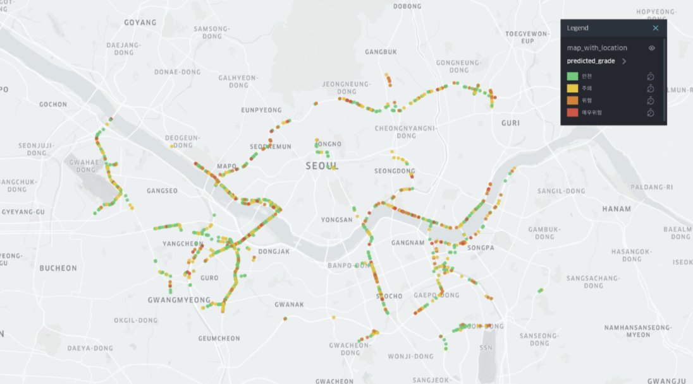
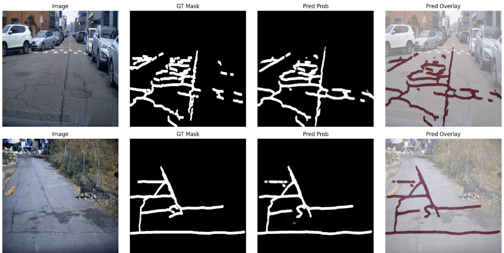
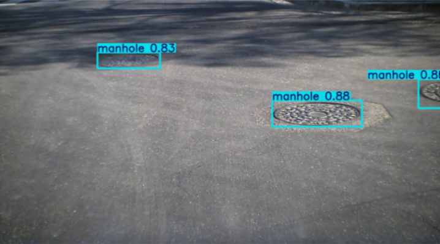
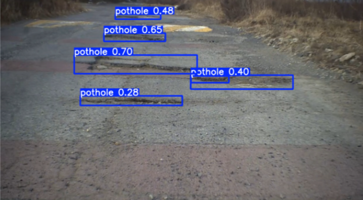

# PM Road Risk Map

> Computer Vision and geospatial data pipeline for predicting personal mobility road-risk levels from road-surface images and DEM-based slope information.

개인형 이동장치(PM)는 작은 바퀴와 낮은 주행 안정성 때문에 포트홀, 맨홀, 균열, 급경사에 민감합니다. 이 프로젝트는 도로 노면 이미지에서 손상 요소를 감지하고, GPS 기반 경사도 정보를 결합해 서울 도로 이미지별 PM 주행 위험도를 예측한 팀 프로젝트입니다.

## Preview



Final output: an interactive Seoul PM risk map with four risk grades: Safe, Caution, Dangerous, and Very dangerous.

## Highlights

- Built an end-to-end risk prediction pipeline from image detection to map visualization.
- Detected potholes and manholes using YOLOv8 object detection.
- Improved pothole detection by identifying label mismatch issues and rebuilding the training dataset.
- Switched crack detection from YOLOv8 segmentation to U-Net because crack labels were thin polyline-style structures.
- Combined road damage, crack severity, and DEM-based slope into a rule-based risk label.
- Trained an XGBoost classifier and visualized PM risk levels on a Folium map.

## My Contribution

- Preprocessed AI-Hub road-surface annotations into YOLO training format.
- Trained and evaluated YOLOv8 models for pothole and manhole detection.
- Analyzed poor pothole performance and found label-image mismatch issues in the initial dataset.
- Built the U-Net crack segmentation workflow using binary masks, Dice Loss, and Focal Loss.
- Designed image-level crack and damage severity metrics from model predictions.
- Integrated damage, crack, and slope features into a final PM risk score.
- Organized the project into a GitHub portfolio repository with notebooks and reusable Python modules.

## Problem

PM riders are more vulnerable to small road-surface defects than cars because PM devices have smaller wheels and lower balance stability. A single pothole or crack can become more dangerous when it appears on a steep road section. Therefore, road risk should be estimated from both visual road damage and spatial slope information.

This project answers the following question:

> Can we estimate PM riding risk by combining road-surface damage detection, crack segmentation, and DEM-based slope features?

## Pipeline

```text
AI-Hub road images and labels
        |
        v
YOLOv8 pothole/manhole detection
        |
        v
U-Net crack segmentation
        |
        v
Image-level damage and crack metrics
        |
        v
GPS + DEM slope extraction
        |
        v
Rule-based risk label generation
        |
        v
XGBoost risk classification
        |
        v
Folium PM risk map
```

## Dataset

Raw datasets are not included in this repository because of size and license constraints.

| Data | Purpose |
|---|---|
| AI-Hub road obstacle / surface images | Train pothole, manhole, and crack models |
| High-resolution road-surface images with GPS | Apply models to Seoul road images |
| DEM elevation data | Extract slope information from GPS coordinates |

## Methods

### 1. Pothole and Manhole Detection

- Model: YOLOv8 detection
- Target classes: pothole and manhole
- Original annotation: bounding boxes
- Output: image-level object counts and area-based damage metrics

The initial pothole model showed poor performance because many labels were not correctly aligned with actual pothole locations. After inspecting label overlays, the dataset was rebuilt using additional verified pothole samples.

### 2. Crack Segmentation

- Initial attempt: YOLOv8 segmentation
- Final model: U-Net with ResNet encoder
- Loss: Dice Loss + Focal Loss
- Output: binary crack mask

Cracks are thin, long, and often represented as polyline labels. Since YOLO segmentation expects object-like polygon regions, U-Net was more suitable for pixel-level crack segmentation.

### 3. Risk Score Modeling

The final risk score combines road-surface damage, crack severity, and slope risk.

```python
final_risk_score = (
    0.45 * damage_grade
    + 0.35 * crack_grade
    + 0.20 * slope_grade
    + 0.4 * I(damage_grade >= 2 and slope_grade >= 2)
    + 0.3 * I(crack_grade >= 2 and slope_grade >= 2)
    + 0.3 * I(damage_grade >= 2 and crack_grade >= 2)
)
```

| Grade | Score Range | Meaning |
|---:|---|---|
| 0 | <= 0.75 | Safe |
| 1 | 0.75 - 1.5 | Caution |
| 2 | 1.5 - 2.25 | Dangerous |
| 3 | > 2.25 | Very dangerous |

## Results

| Task | Model | Metric | Result |
|---|---|---:|---:|
| Pothole and manhole detection | YOLOv8 | Overall mAP50 | 0.703 |
| Pothole detection | YOLOv8 | Pothole mAP50 | 0.476 |
| Manhole detection | YOLOv8 | Manhole mAP50 | 0.929 |
| Crack segmentation | U-Net | Dice / IoU | 0.6549 / 0.5096 |
| Risk classification | XGBoost | Accuracy / F1 | 0.9174 / 0.9163 |
| Risk classification | XGBoost | 5-Fold CV | 0.9375 ± 0.0189 |

Additional crack segmentation test result:

| Metric | Value |
|---|---:|
| Test Loss | 0.4549 |
| Test Dice | 0.6549 |
| Test IoU | 0.5096 |

### Model Improvement

| Experiment | Overall mAP50 | Pothole mAP50 | Manhole mAP50 |
|---|---:|---:|---:|
| Initial dataset | 0.484 | 0.0939 | 0.875 |
| Rebuilt dataset | 0.703 | 0.476 | 0.929 |

## Key Learnings

- Label quality had a larger impact on pothole detection than simply changing the model architecture.
- Thin crack structures were better represented as pixel-level masks than object-like segmentation polygons.
- Combining road-surface damage with DEM-based slope made the risk score more relevant to PM riding conditions.
- Rule-based labels were useful for prototyping, but real accident or road-maintenance records would be needed for deployment-level validation.

## Example Outputs

| Crack Segmentation | Manhole Detection | Pothole Detection |
|---|---|---|
|  |  |  |

## Repository Structure

```text
pm-road-risk-map/
  configs/
    yolo_pothole_manhole.yaml
  data/
    README.md
  docs/
    final_presentation.pdf
    images/
  notebooks/
    01_pothole_manhole_yolov8.ipynb
    02_crack_unet_segmentation.ipynb
    03_risk_score_and_map.ipynb
  outputs/
    README.md
  src/
    road_risk/
      pothole_manhole.py
      crack_unet.py
      risk_scoring.py
      visualization.py
  requirements.txt
```

## How to Run

Install dependencies:

```bash
pip install -r requirements.txt
```

### Quick Demo with Sample Data

This repository includes a tiny sample dataset under `data/sample/` so the risk-scoring and map-generation part can be tested without downloading the original datasets or model weights.

```bash
python scripts/run_demo.py
```

Expected outputs:

```text
outputs/demo/sample_risk_predictions.csv
outputs/demo/sample_risk_map.html
```

If `folium` is installed, the HTML file is generated as an interactive map. If not, the script still creates a lightweight static HTML risk report.

The demo uses precomputed example features that mimic YOLO, U-Net, and DEM outputs:

| File | Meaning |
|---|---|
| `data/sample/road_damage_summary.csv` | Pothole/manhole detection summary |
| `data/sample/crack_metrics.csv` | Crack segmentation metrics |
| `data/sample/slope_features.csv` | GPS coordinates and slope values |

### Full Colab Workflow

Run the notebooks in order:

1. `notebooks/01_pothole_manhole_yolov8.ipynb`
2. `notebooks/02_crack_unet_segmentation.ipynb`
3. `notebooks/03_risk_score_and_map.ipynb`

The original workflow was developed in Google Colab with Google Drive-mounted datasets.

## Tech Stack

- Python
- PyTorch
- Ultralytics YOLOv8
- segmentation-models-pytorch
- OpenCV
- scikit-image
- XGBoost
- Folium
- pandas, NumPy, scikit-learn

## Limitations and Future Work

- Raw data and trained weights are not included because of dataset size and license constraints.
- Risk labels are rule-based, so they should be validated with real accident or road-maintenance data in future work.
- DEM-based slope is useful, but local road surface conditions may require higher-resolution spatial data.
- Model robustness can be improved with additional manually verified pothole and crack samples.

## Presentation

The final team presentation is included at `docs/final_presentation.pdf`.
